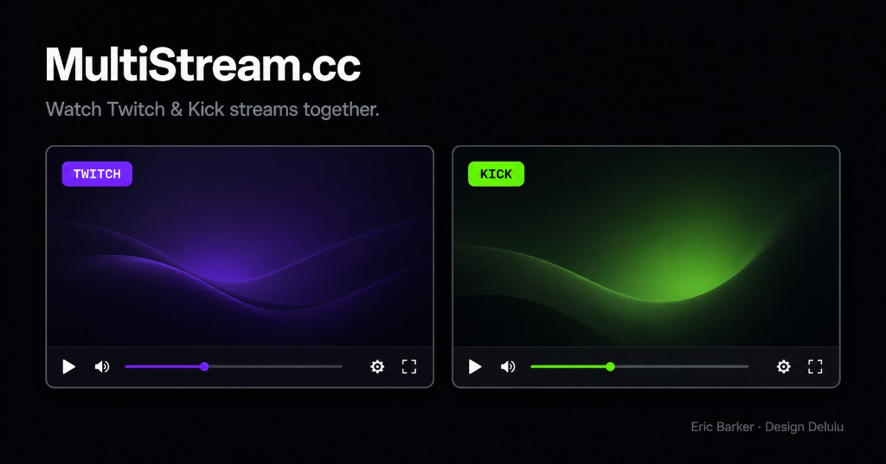

# MultiStream.cc

Watch multiple **Twitch** and **Kick** live streams on one page — in a responsive grid that keeps every player as large as possible at 16:9.



**Live site:** [multistream.cc](https://multistream.cc)  
**Repository:** [github.com/designdelulu/multistream](https://github.com/designdelulu/multistream)

Built by [Eric Barker](https://ericbarker.co). A product of [Design Delulu](https://designdelulu.com).

---

## What it does

MultiStream.cc is a lightweight browser viewer for multi-stream watch parties, co-stream monitoring, and tournament weekends. Add channels from the toolbar or share a URL with your lineup already configured.

- **Twitch + Kick** on the same page
- **Responsive grid** that scales players while preserving aspect ratio
- **Shareable URLs** via `?streams=` query parameters
- **Mute / remove** controls per stream
- **No backend required** — static deploy, iframe embeds only

Inspired by the classic [MultiTwitch](https://github.com/bhamrick/multitwitch) project, rebuilt for modern platforms and maintainability.

---

## Quick start (local dev)

```bash
npm install
npm run dev
```

Open the URL Vite prints (default `http://localhost:5173/`). First visit loads **twitch:shroud** and **kick:xqc** side by side.

### Production build

```bash
npm run build
npm run preview
```

Deploy the `dist/` folder to any static host (Cloudflare Pages, Netlify, Vercel, S3, etc.).

### DreamHost (multistream.cc)

Do **not** upload the whole project folder. DreamHost needs the **built output**:

```bash
npm install
npm run build
```

Upload everything inside **`dist/`** to your domain’s web root (e.g. `multistream.cc/` → `~/multistream.cc/` on DreamHost):

```
dist/
├── index.html
├── assets/
├── robots.txt
└── .htaccess
```

Steps:

1. Run `npm run build` locally whenever you change the app.
2. In DreamHost File Manager or FTP, open the folder for **multistream.cc**.
3. Upload the **contents** of `dist/` (not the `dist` folder itself) into that root.
4. Confirm `index.html` sits directly in the domain root.
5. Visit `https://multistream.cc/` — Twitch embeds will automatically use `multistream.cc` as the `parent` domain.

Query-param URLs like `?streams=twitch:shroud,kick:xqc` work without any server-side routing config.

---

## Usage

### Share a layout

List streams in the `streams` query parameter, comma-separated:

```
https://multistream.cc/?streams=twitch:shroud,kick:xqc
```

### Add streams from the toolbar

| You enter | Result |
|---|---|
| `shroud` | Twitch channel **shroud** |
| `kick.com/xqc` | Kick channel **xqc** |
| `twitch:shroud` | Twitch (explicit prefix) |
| `kick:xqc` | Kick (explicit prefix) |

Plain usernames default to Twitch. Use a full URL or `kick:` prefix for Kick channels.

---

## Architecture

Vanilla **TypeScript + Vite** — no React, no server.

```
src/
├── platforms/     # Twitch & Kick adapters (parse input, build embed URLs)
├── state/         # Stream list, URL sync, localStorage
├── components/    # Grid, toolbar, player cards
└── styles/        # Layout and UI
```

Each platform implements a small adapter:

- `parseInput()` — username, URL, or `platform:channel`
- `buildEmbedUrl()` — iframe src with correct embed parameters

Adding a third platform later means adding one adapter file and registering it — no changes to the grid or state layer.

---

## Embed notes

- Players must be served over **HTTP(S)** — `file://` will not work.
- **Twitch** embeds require a matching `parent` domain (injected automatically from `window.location.hostname`).
- **Kick** embeds use `https://player.kick.com/{username}` with `autoplay` and `muted` query params.
- **Mute/unmute** reloads the iframe; cross-origin players do not expose volume APIs to the parent page.

---

## Social / SEO image

Add a repository and Open Graph image at `public/og-image.png` (recommended **1200×630**). The site meta tags already reference `https://multistream.cc/og-image.png`.

---

## Contributing

Issues and PRs welcome. Keep changes focused — this project intentionally stays small.

---

## License

MIT — see [LICENSE](LICENSE).

---

## Credits

- Original inspiration: [bhamrick/multitwitch](https://github.com/bhamrick/multitwitch) by Brian Hamrick
- Developer: [Eric Barker](https://ericbarker.co)
- Studio: [Design Delulu](https://designdelulu.com)
